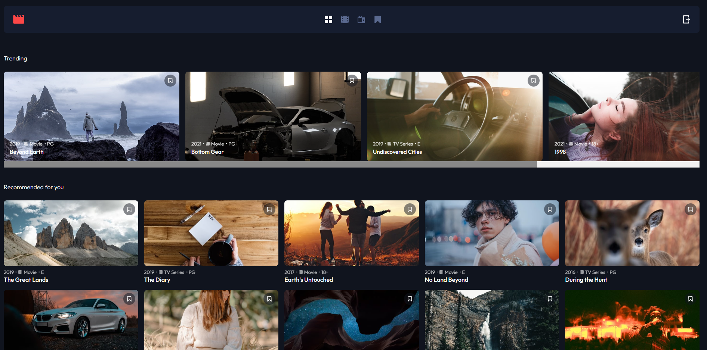

# Entertainment app

## Technologies

- Vue
- Tailwind
- Firebase

This is a small project made to learn basics of Vue. Authentification is provided by firebase but could be improved by using vuex (might happen in the future as an optimization).
Each user can create an account (no validation require except the basic email format and six characters long passwords), login, add and remove movies to his bookmarks and logout.

Movies are provided by a JSON file.
